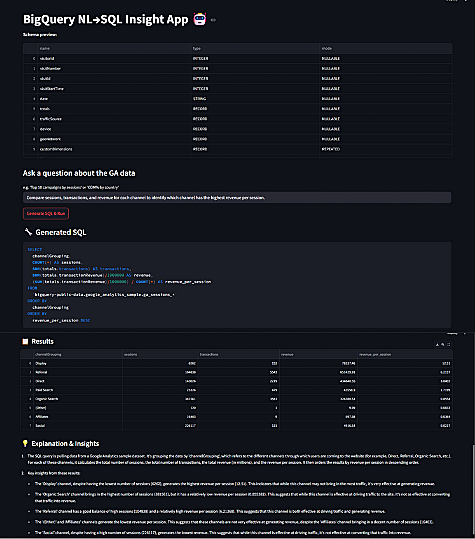

# BigQuery NL→SQL Insight App

A Streamlit web application that lets users ask natural language questions and receive SQL-generated insights from Google BigQuery datasets. It combines OpenAI's GPT model for natural language to SQL generation, BigQuery for data retrieval, and Streamlit for an intuitive frontend.

---

---
## 🚀 Features

- 🔍 Natural language query to SQL using GPT
- 📊 Runs SQL directly on BigQuery public datasets
- 🧠 Auto-generated English explanation + insights from query results
- 🧾 Schema preview for selected BigQuery table
- 🖥️ Clean and interactive Streamlit interface
- 🔐 Secure credential management via environment variables

---

## 📦 Tech Stack

- **Frontend**: Streamlit
- **Backend**: Python
- **AI**: OpenAI GPT (via `openai` API)
- **Database**: Google BigQuery (via `google-cloud-bigquery`)
- **Logging**: Python logging module

---

## 🛠️ Setup Instructions

### 1. Clone the repository

```bash
git clone https://github.com/yourusername/bigquery-nl-sql-insight-app.git
cd bigquery-nl-sql-insight-app
````

### 2. Install Dependencies

```bash
pip install -r requirements.txt
```

Requirements include:

* `streamlit`
* `openai`
* `pandas`
* `google-cloud-bigquery`
* `google-auth`

### 3. Set Environment Variables

Create a `.env` file or set in your terminal:

```bash
export OPENAI_API_KEY="your-openai-api-key"
export GOOGLE_APPLICATION_CREDENTIALS="/path/to/your/service-account.json"
```

### 4. Run the Streamlit App

```bash
streamlit run app.py
```

---

## 🌐 Dataset Used

Currently using:

* `bigquery-public-data.google_analytics_sample`

This can be replaced or extended by changing the `datasets` in the app configuration.

---

## 📄 License

MIT License © 2025 


